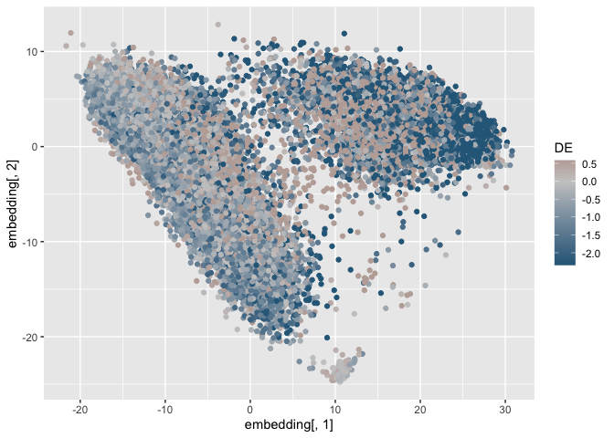

<!-- README.md is generated from README.Rmd. Please edit that file -->

# lemur.utils

<!-- badges: start -->
<!-- badges: end -->

Helper functions to manage the output of
[`lemur`](https://www.bioconductor.org/packages/lemur/).

## Installation

You can install the development version of lemur.utils from
[GitHub](https://github.com/) with:

``` r
# install.packages("devtools")
devtools::install_github("const-ae/lemur.utils")
```

# Disclaimer

This package is in an very early stage of development and the API is not
considered stable.

# Documentation

I will demonstrate the functions using the data by Kang et al. (2018).

``` r
library(lemur)
library(lemur.utils)
library(SingleCellExperiment)
library(tidyverse)
set.seed(1)

# Prepare the data
sce <- muscData::Kang18_8vs8()
logcounts(sce) <- transformGamPoi::shifted_log_transform(sce)
hvg <- order(-rowVars(logcounts(sce)))
sce <- sce[hvg[1:500],]

fit <- lemur(sce, design = ~ stim, n_embedding = 10, verbose = FALSE)
fit <- align_harmony(fit)
fit <- test_de(fit, contrast = cond(stim = "stim") - cond(stim = "ctrl"))
nei <- find_de_neighborhoods(fit, group_by = vars(ind))

as_tibble(nei)
#> # A tibble: 500 × 13
#>    name   neighborhood n_cells sel_statistic     pval adj_pval f_statistic   df1
#>    <chr>  <I<list>>      <int>         <dbl>    <dbl>    <dbl>       <dbl> <int>
#>  1 FTL    <chr>          18430         -105. 7.53e- 2 9.12e- 2        3.58     1
#>  2 FTH1   <chr>          23291         -685. 4.42e- 6 1.38e- 5       43.2      1
#>  3 ISG15  <chr>           7151          779. 9.47e-11 1.44e- 9      191.       1
#>  4 CXCL10 <chr>           8241          238. 3.90e-14 2.86e-12      495.       1
#>  5 TIMP1  <chr>           7936         -319. 5.99e- 5 1.42e- 4       27.8      1
#>  6 TMSB4X <chr>           8058         -122. 1.26e- 4 2.64e- 4       24.2      1
#>  7 CCL2   <chr>           5851          202. 1.86e- 4 3.82e- 4       22.4      1
#>  8 RPL3   <chr>          26494         -499. 9.34e- 3 1.34e- 2        8.56     1
#>  9 CCL8   <chr>           2924          238. 3.51e- 7 1.50e- 6       63.5      1
#> 10 RPS18… <chr>          12707         -227. 4.97e- 2 6.19e- 2        4.46     1
#> # ℹ 490 more rows
#> # ℹ 5 more variables: df2 <dbl>, lfc <dbl>, did_pval <dbl>, did_adj_pval <dbl>,
#> #   did_lfc <dbl>
```

### Neighborhood helpers

#### `neighborhoods_to_long_data()`

Convert the neighborhood column from the output of
`lemur::find_de_neighborhoods` to a tidy tibble.

``` r
# By default the long data contains all gene / cell combinations
neighborhoods_to_long_data(nei, fit = fit)
#> # A tibble: 14,532,500 × 3
#>    name  cell             inside
#>    <fct> <fct>            <lgl> 
#>  1 FTL   AAACATACAATGCC-1 TRUE  
#>  2 FTL   AAACATACATTTCC-1 FALSE 
#>  3 FTL   AAACATACCAGAAA-1 TRUE  
#>  4 FTL   AAACATACCAGCTA-1 TRUE  
#>  5 FTL   AAACATACCATGCA-1 TRUE  
#>  6 FTL   AAACATACCTCGCT-1 TRUE  
#>  7 FTL   AAACATACCTGGTA-1 FALSE 
#>  8 FTL   AAACATACGATGAA-1 TRUE  
#>  9 FTL   AAACATACGCCAAT-1 FALSE 
#> 10 FTL   AAACATACGCTTCC-1 TRUE  
#> # ℹ 14,532,490 more rows
# `only_keep_inside` filters out `inside == FALSE` and produces a smaller tibble
neighborhoods_to_long_data(nei, fit = fit, only_keep_inside = TRUE)
#> # A tibble: 6,163,461 × 3
#>    name  cell             inside
#>    <fct> <fct>            <lgl> 
#>  1 FTL   AAACATACAATGCC-1 TRUE  
#>  2 FTL   AAACATACCAGAAA-1 TRUE  
#>  3 FTL   AAACATACCAGCTA-1 TRUE  
#>  4 FTL   AAACATACCATGCA-1 TRUE  
#>  5 FTL   AAACATACCTCGCT-1 TRUE  
#>  6 FTL   AAACATACGATGAA-1 TRUE  
#>  7 FTL   AAACATACGCTTCC-1 TRUE  
#>  8 FTL   AAACATACGGCATT-1 TRUE  
#>  9 FTL   AAACATACGTGTAC-1 TRUE  
#> 10 FTL   AAACATACTGGTCA-1 TRUE  
#> # ℹ 6,163,451 more rows
```

#### `neighborhoods_to_matrix()`

Convert the neighborhood column from the output of
`lemur::find_de_neighborhoods` to a 0/1 matrix.

``` r
neighborhoods_to_matrix(nei, fit = fit)
#> 500 x 29065 sparse Matrix of class "dgCMatrix"
#>   [[ suppressing 33 column names 'AAACATACAATGCC-1', 'AAACATACATTTCC-1', 'AAACATACCAGAAA-1' ... ]]
#>   [[ suppressing 33 column names 'AAACATACAATGCC-1', 'AAACATACATTTCC-1', 'AAACATACCAGAAA-1' ... ]]
#>                                                                              
#> FTL  1 . 1 1 1 1 . 1 . 1 1 1 . 1 1 1 . . . 1 1 1 1 1 1 1 . 1 . 1 1 1 1 ......
#> FTH1 1 1 1 1 1 1 1 1 1 1 1 . 1 1 1 1 . . 1 1 1 . 1 1 1 1 1 . 1 1 . 1 1 ......
#> 
#>  ..............................
#>  ........suppressing 29032 columns and 497 rows in show(); maybe adjust options(max.print=, width=)
#>  ..............................
#>   [[ suppressing 33 column names 'AAACATACAATGCC-1', 'AAACATACATTTCC-1', 'AAACATACCAGAAA-1' ... ]]
#>                                                                                 
#> HNRNPA3 1 1 1 1 1 1 1 1 1 1 1 1 1 1 1 . 1 1 1 1 1 1 1 . 1 1 . 1 . 1 1 1 1 ......
```

#### `count_labels_per_neighborhood()`

Count the occurrences of a cell label per neighborhood.

``` r
count_labels_per_neighborhood(nei, labels = vars(cell), fit = fit)
#> # A tibble: 4,500 × 4
#>    name  label             counts total_counts
#>    <chr> <fct>              <dbl>        <int>
#>  1 FTL   CD4 T cells         9018        12033
#>  2 FTL   CD14+ Monocytes     4425         6447
#>  3 FTL   Dendritic cells       21          472
#>  4 FTL   NK cells            1742         2330
#>  5 FTL   CD8 T cells         2017         2634
#>  6 FTL   B cells               69         2880
#>  7 FTL   Megakaryocytes       243          346
#>  8 FTL   FCGR3A+ Monocytes    886         1914
#>  9 FTL   <NA>                   9            9
#> 10 FTH1  CD4 T cells        10659        12033
#> # ℹ 4,490 more rows
```

### Make tidy

#### `fit_pivot_longer`

The `fit_pivot_longer` works on the `lemur_fit` objects. For
`SingleCellExperiment` objects use the `sce_pivot_longer` function,
which works analogously but has slightly different defaults.

Be careful when using this function: the output tibble will have
`n_genes * n_cells` rows, which for `n_genes = 1e4` and `n_cells = 1e4`
produces a 100 million rows.

``` r
# Select genes by name
fit_pivot_longer(fit, genes = "FTH1")
#> # A tibble: 29,065 × 9
#>      ind stim  cluster cell    multiplets embedding[,1] ENSEMBL SYMBOL logcounts
#>    <int> <fct>   <int> <fct>   <fct>              <dbl> <chr>   <chr>      <dbl>
#>  1   107 ctrl        5 CD4 T … doublet           -12.1  ENSG00… FTH1        7.40
#>  2  1016 ctrl        9 CD14+ … singlet            19.3  ENSG00… FTH1       16.3 
#>  3  1256 ctrl        9 CD14+ … singlet            26.1  ENSG00… FTH1       19.1 
#>  4  1256 ctrl        9 CD14+ … doublet            20.7  ENSG00… FTH1       16.1 
#>  5  1488 ctrl        3 CD4 T … singlet            11.8  ENSG00… FTH1        9.07
#>  6  1256 ctrl        9 CD14+ … singlet            24.0  ENSG00… FTH1       18.2 
#>  7  1039 ctrl        4 Dendri… singlet             6.77 ENSG00… FTH1       11.3 
#>  8  1488 ctrl        5 CD4 T … singlet            -8.57 ENSG00… FTH1       16.4 
#>  9  1016 ctrl        9 CD14+ … singlet            17.1  ENSG00… FTH1       16.8 
#> 10  1256 ctrl        5 CD4 T … singlet           -11.2  ENSG00… FTH1        6.01
#> # ℹ 29,055 more rows
#> # ℹ 1 more variable: embedding[2:10] <dbl>

# Select genes by index
fit_pivot_longer(fit, genes = 1:3)
#> # A tibble: 87,195 × 9
#>      ind stim  cluster cell    multiplets embedding[,1] ENSEMBL SYMBOL logcounts
#>    <int> <fct>   <int> <fct>   <fct>              <dbl> <chr>   <chr>      <dbl>
#>  1   107 ctrl        5 CD4 T … doublet            -12.1 ENSG00… FTL         0   
#>  2   107 ctrl        5 CD4 T … doublet            -12.1 ENSG00… FTH1        7.40
#>  3   107 ctrl        5 CD4 T … doublet            -12.1 ENSG00… ISG15       0   
#>  4  1016 ctrl        9 CD14+ … singlet             19.3 ENSG00… FTL        14.9 
#>  5  1016 ctrl        9 CD14+ … singlet             19.3 ENSG00… FTH1       16.3 
#>  6  1016 ctrl        9 CD14+ … singlet             19.3 ENSG00… ISG15       0   
#>  7  1256 ctrl        9 CD14+ … singlet             26.1 ENSG00… FTL        13.1 
#>  8  1256 ctrl        9 CD14+ … singlet             26.1 ENSG00… FTH1       19.1 
#>  9  1256 ctrl        9 CD14+ … singlet             26.1 ENSG00… ISG15       0   
#> 10  1256 ctrl        9 CD14+ … doublet             20.7 ENSG00… FTL        16.5 
#> # ℹ 87,185 more rows
#> # ℹ 1 more variable: embedding[2:10] <dbl>

# Select genes with filter statement wrapped in `vars`
fit_pivot_longer(fit, genes = vars(str_starts(SYMBOL, "HSP")))
#> # A tibble: 232,520 × 9
#>      ind stim  cluster cell    multiplets embedding[,1] ENSEMBL SYMBOL logcounts
#>    <int> <fct>   <int> <fct>   <fct>              <dbl> <chr>   <chr>      <dbl>
#>  1   107 ctrl        5 CD4 T … doublet            -12.1 ENSG00… HSPA8      1.49 
#>  2   107 ctrl        5 CD4 T … doublet            -12.1 ENSG00… HSP90…     0    
#>  3   107 ctrl        5 CD4 T … doublet            -12.1 ENSG00… HSP90…     0.555
#>  4   107 ctrl        5 CD4 T … doublet            -12.1 ENSG00… HSPB1      0    
#>  5   107 ctrl        5 CD4 T … doublet            -12.1 ENSG00… HSPA1A     0    
#>  6   107 ctrl        5 CD4 T … doublet            -12.1 ENSG00… HSPA5      0.555
#>  7   107 ctrl        5 CD4 T … doublet            -12.1 ENSG00… HSPD1      1.05 
#>  8   107 ctrl        5 CD4 T … doublet            -12.1 ENSG00… HSPE1      0    
#>  9  1016 ctrl        9 CD14+ … singlet             19.3 ENSG00… HSPA8      1.13 
#> 10  1016 ctrl        9 CD14+ … singlet             19.3 ENSG00… HSP90…     0.785
#> # ℹ 232,510 more rows
#> # ℹ 1 more variable: embedding[2:10] <dbl>

# Select cells by cell type and condition
fit_pivot_longer(fit, genes = 1:10, cells = vars(cell == "CD 4 T cells" | stim == "ctrl"))
#> # A tibble: 146,190 × 9
#>      ind stim  cluster cell    multiplets embedding[,1] ENSEMBL SYMBOL logcounts
#>    <int> <fct>   <int> <fct>   <fct>              <dbl> <chr>   <chr>      <dbl>
#>  1   107 ctrl        5 CD4 T … doublet            -12.1 ENSG00… FTL         0   
#>  2   107 ctrl        5 CD4 T … doublet            -12.1 ENSG00… FTH1        7.40
#>  3   107 ctrl        5 CD4 T … doublet            -12.1 ENSG00… ISG15       0   
#>  4   107 ctrl        5 CD4 T … doublet            -12.1 ENSG00… CXCL10      0   
#>  5   107 ctrl        5 CD4 T … doublet            -12.1 ENSG00… TIMP1       0   
#>  6   107 ctrl        5 CD4 T … doublet            -12.1 ENSG00… TMSB4X     11.4 
#>  7   107 ctrl        5 CD4 T … doublet            -12.1 ENSG00… CCL2        0   
#>  8   107 ctrl        5 CD4 T … doublet            -12.1 ENSG00… RPL3        6.80
#>  9   107 ctrl        5 CD4 T … doublet            -12.1 ENSG00… CCL8        0   
#> 10   107 ctrl        5 CD4 T … doublet            -12.1 ENSG00… RPS18       6.66
#> # ℹ 146,180 more rows
#> # ℹ 1 more variable: embedding[2:10] <dbl>
```

### Plotting helpers

#### `scale_color_de` / `scale_fill_de`

``` r
fit_pivot_longer(fit, genes = 1, assays = "DE", reduced_dims = "embedding") %>%
  ggplot(aes(x = embedding[,1], y = embedding[,2])) +
    geom_point(aes(color = DE)) +
    scale_color_de(qlimits = 0.1)
```



### Projection onto a reference dataset

#### `transfer_col_data`

After integrating a query and a reference dataset, transfer the
annotation from the reference data to the query data. The `ref` and
`query` data must contain a shared embedding, produced by manually
integrating them with Seurat, harmony, or LEMUR.

``` r
# This is a completely simulated example to demonstrate how to call the `transfer_col_data` function
ref_sce <- SingleCellExperiment(list(logcounts = matrix(1, nrow = 400, ncol = 300)),
                                colData = DataFrame(celltype = sample(c("A", "B", "C"), size = 300, replace = TRUE),
                                                    origin = sample(c("foo", "bar"), size = 300, replace = TRUE)),
                                reducedDims = list(embedding = t(matrix(rnorm(10 * 300), nrow = 10, ncol = 300))))

transfer_col_data(ref_sce, fit, columns = vars(celltype, origin))
#> # A tibble: 29,065 × 2
#>    celltype origin
#>    <chr>    <chr> 
#>  1 A        bar   
#>  2 A        foo   
#>  3 C        bar   
#>  4 C        bar   
#>  5 B        bar   
#>  6 C        bar   
#>  7 C        bar   
#>  8 C        bar   
#>  9 C        bar   
#> 10 B        bar   
#> # ℹ 29,055 more rows
```

# Session Info

``` r
sessionInfo()
#> R version 4.3.2 (2023-10-31)
#> Platform: x86_64-apple-darwin20 (64-bit)
#> Running under: macOS Sonoma 14.5
#> 
#> Matrix products: default
#> BLAS:   /Library/Frameworks/R.framework/Versions/4.3-x86_64/Resources/lib/libRblas.0.dylib 
#> LAPACK: /Library/Frameworks/R.framework/Versions/4.3-x86_64/Resources/lib/libRlapack.dylib;  LAPACK version 3.11.0
#> 
#> locale:
#> [1] en_US.UTF-8/en_US.UTF-8/en_US.UTF-8/C/en_US.UTF-8/en_US.UTF-8
#> 
#> time zone: Europe/Berlin
#> tzcode source: internal
#> 
#> attached base packages:
#> [1] stats4    stats     graphics  grDevices utils     datasets  methods  
#> [8] base     
#> 
#> other attached packages:
#>  [1] muscData_1.16.0      ExperimentHub_2.10.0 AnnotationHub_3.10.0
#>  [4] BiocFileCache_2.10.1 dbplyr_2.4.0         lubridate_1.9.3     
#>  [7] forcats_1.0.0        stringr_1.5.1        dplyr_1.1.4         
#> [10] purrr_1.0.2         
#>  [ reached getOption("max.print") -- omitted 17 entries ]
#> 
#> loaded via a namespace (and not attached):
#>  [1] DBI_1.2.2                 bitops_1.0-7             
#>  [3] transformGamPoi_1.6.0     rlang_1.1.3              
#>  [5] magrittr_2.0.3            compiler_4.3.2           
#>  [7] RSQLite_2.3.5             DelayedMatrixStats_1.24.0
#>  [9] png_0.1-8                 vctrs_0.6.5              
#>  [ reached getOption("max.print") -- omitted 78 entries ]
```
